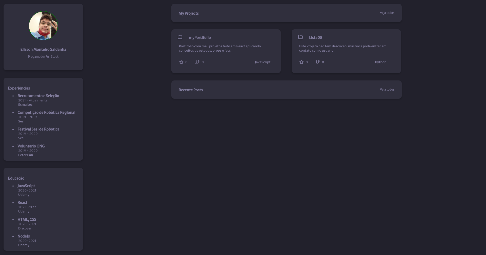

# My Projects
**Status do projeto:** Em andamento

**Description:**

Este projeto tem o intuito de demonstrar meus projetes recentes, minhas experiências, conhecimentos e facilitar o contato com o desenvolvedor do projeto por meio das redes sociais disponiveis . Não só isso, mas também colocar em pratica recursos aprendido de React. Utilizei API do github para selecionar os meus dois projetos mais recentes 

**Recursos Utilizados:**
 * React e JS
    * Props e Componentes
    * Ciclo de vida do Component
    * Consumo de API do gitHub utilizando fetch
 * HTML, CSS
    * Grid
    * flex box 

**Resultado:**

**Link:** [My-portifolio](https://my-portifolio-nho3tg8xf-saldanhaelisson.vercel.app/)